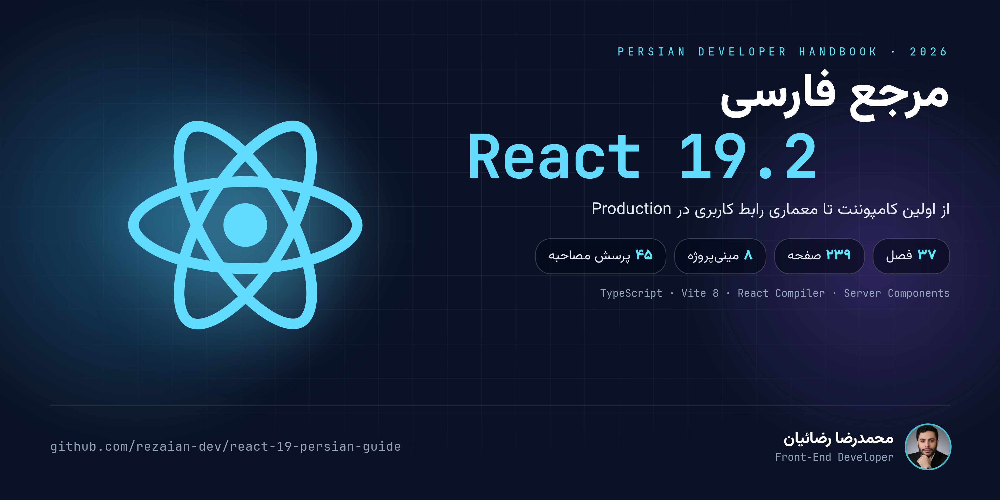
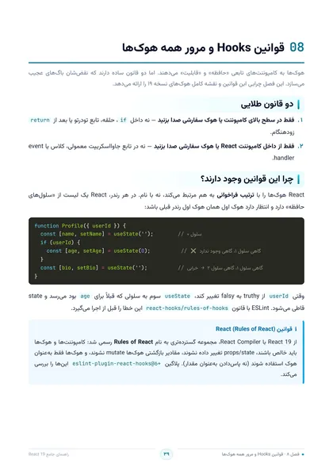
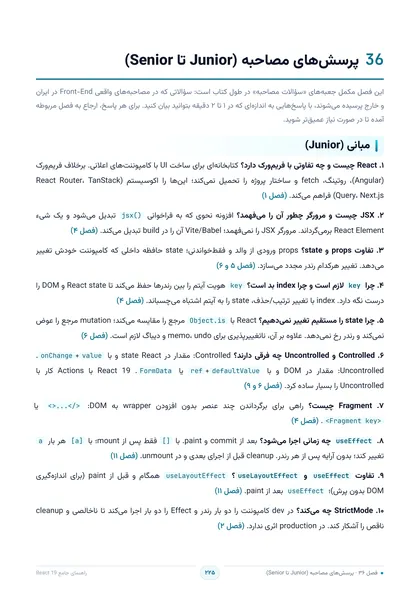

  

  <strong>🎉 راهنمای کامل React 19.2 به زبان فارسی — رایگان برای استفادهٔ غیرتجاری</strong>

  
  
  

  
  
  
  
  
  

---

## ✨ این راهنما چیست؟

> **مرجع فارسی، پروژه‌محور و به‌روز React 19.2** — از اولین کامپوننت تا معماری رابط کاربری در Production.

React 19 قواعد بازی را عوض کرد: **Actions**، `useOptimistic`، API `use` و **React Compiler**. این کتاب همین‌ها را — برای اولین بار به فارسی — با **زبان ساده، مدل ذهنی درست و کد واقعی** توضیح می‌دهد.

اینجا قرار نیست فهرست هوک‌ها را حفظ کنید؛ قرار است یاد بگیرید مثل یک مهندس ارشد **فکر کنید، تصمیم بگیرید و معماری بچینید**. 🧠

## 👥 برای چه کسی؟

| 🎯 اگر شما… | 📦 این کتاب به شما می‌دهد |
|:---:|:---:|
| تازه وارد دنیای React شده‌اید | مسیر یادگیری گام‌به‌گام از JSX تا یک اپ کامل مدیریت وظایف |
| با نسخه‌های قبلی کار کرده‌اید | نقشهٔ ارتقای دقیق به ۱۹: Actions، `use`، Compiler و Activity |
| دنبال سطح ارشد هستید | معماری feature-based، الگوهای پیشرفته، تست، امنیت و کارایی |
| در مسیر استخدام هستید | ۴۵ پرسش مصاحبهٔ سطح‌بندی‌شده و واژه‌نامهٔ ۱۳۳ مدخلی تخصصی |

## 📋 پیش‌نیازها

آنچه خود کتاب (فصل ۱) لازم می‌داند:

- 🟨 **JavaScript مدرن (ES2020+):** ‏`const`/`let`، arrow function، destructuring، spread، ‏`async`/`await`، ماژول‌ها و متدهای آرایه (`map`/`filter`/`reduce`)
- 🎨 **HTML و CSS پایه:** عناصر، ویژگی‌ها و Flexbox
- 🔷 **TypeScript مقدماتی** مفید است ولی الزامی نیست؛ فصل ۱۵ کامل به آن می‌پردازد (همهٔ مثال‌ها TypeScript هستند)
- 🛠️ **Node.js نسخه ۲۰.۱۹ یا بالاتر** و یک ویرایشگر مثل VS Code برای تمرین‌ها

> 💡 اگر با `map`/`filter`، ‏destructuring و `async`/`await` راحت نیستید، اول ۲ تا ۳ روز روی JavaScript مدرن وقت بگذارید؛ React خودش ساده است و بیشتر سردرگمی‌ها از JavaScript می‌آیند. (فصل ۳)

## 💎 چرا این کتاب متفاوت است؟

- ⚡ **همگام با React 19.2** — `useActionState`، `useOptimistic`، `useEffectEvent`، `<Activity>` و React Compiler
- 🧠 **تمرکز بر «چرا»** — درک مدل رندر و رفتار کامپوننت‌ها به‌جای حفظ‌کردن سینتکس
- 💻 **کد واقعی، نه اسلایدهای تئوری** — پنجره‌های کد TypeScript با مرز سرور و کلاینت روشن
- 🛠️ **یادگیری با دست** — یک اپ کامل مدیریت وظایف + ۸ مینی‌پروژهٔ کارگاهی
- 🏗️ **معماری در مقیاس** — ساختار feature-based، Zustand/Redux/Jotai و الگوهای Compound و Headless
- 🇮🇷 **فارسی روان، اصطلاح‌ها دوزبانه** — با واژه‌نامهٔ فارسی–انگلیسی پایان کتاب

## 🗺️ مسیر کتاب در یک نگاه

| 🌱 بنیادها فصل ۱–۱۸ | 🏗️ معماری و Production فصل ۱۹–۳۲ | 🛠️ کارگاه فصل ۳۳–۳۵ | 🎓 مرجع شغلی فصل ۳۶–۳۷ |
|:---:|:---:|:---:|:---:|
| JSX، State، Hooks، Actions و پروژهٔ کامل | Compiler، امنیت، تست، Server Components و استقرار | ۸ مینی‌پروژه، نکات طلایی و بهترین شیوه‌ها | ۴۵ پرسش مصاحبه و واژه‌نامهٔ فارسی–انگلیسی |

💡 مسیر پیشنهادی همین ترتیب است؛ اما اگر تجربه دارید، هر فصل مستقل هم خوانده می‌شود. [فهرست کامل فصل‌ها ↓](#chapters)

## 🖼️ نگاهی به داخل کتاب

  
  
  
  
  

💡 روی هر تصویر کلیک کنید تا در اندازهٔ کامل باز شود.

## 📦 در چه قالبی می‌خواهید؟

| قالب | مناسب برای | لینک |
|:---:|:---:|:---:|
| 🌐 **آنلاین** | مطالعهٔ فوری هر ۲۳۹ صفحه در مرورگر با پیوند مستقیم به هر فصل | [**شروع مطالعه**](https://rezaian-dev.github.io/react-19-persian-guide/book/) |
| 📕 **PDF** | دانلود، جست‌وجو و چاپ — قطع A4 رنگی، ۲۳۹ صفحه | [**دانلود**](https://github.com/rezaian-dev/react-19-persian-guide/releases/download/v1.0.3/React19-Persian-Guide.pdf) |
| 📗 **EPUB** | موبایل و کتاب‌خوان — متن واقعی بازچینش‌پذیر راست‌به‌چپ با فونت داخلی | [**دانلود**](https://github.com/rezaian-dev/react-19-persian-guide/releases/download/v1.0.3/React19-Persian-Guide.epub) |
| 🖨️ **چاپ** | نسخهٔ سیاه‌وسفید بهینه برای چاپ لیزری، ۲۴۰ صفحه | [**دانلود**](https://github.com/rezaian-dev/react-19-persian-guide/releases/download/v1.0.3/React19-Persian-Guide-Print.pdf) |

> ⚠️ **شفاف دربارهٔ قالب‌ها:** نسخهٔ آنلاین **تصویرمحور** است؛ متن آن قابل انتخاب و جست‌وجو نیست و بازچینش نمی‌شود، اما هر صفحه دکمهٔ «بزرگ‌نمایی» برای بازشدن در اندازهٔ کامل دارد. برای متن قابل جست‌وجو از **PDF** و برای مطالعه در موبایل و کتاب‌خوان از **EPUB** (متن واقعی) استفاده کنید.

## 📚 فهرست کامل ۳۷ فصل

[🗂️ فهرست تعاملی فصل‌ها در سایت](https://rezaian-dev.github.io/react-19-persian-guide/chapters/) — یا از فهرست زیر مستقیم به هر فصل در نسخهٔ آنلاین بروید:

<strong>نمایش فهرست</strong> <em>(برای باز کردن کلیک کنید)</em>

**🌱 بخش اول — بنیادها و مفاهیم اصلی · فصل‌های ۱ تا ۱۸**

1. [معرفی React و تازه‌های نسخه ۱۹](https://rezaian-dev.github.io/react-19-persian-guide/book/#ch-01) — ص ۴
2. [شروع به کار و ساختار پروژه](https://rezaian-dev.github.io/react-19-persian-guide/book/#ch-02) — ص ۸
3. [نقشه راه یادگیری](https://rezaian-dev.github.io/react-19-persian-guide/book/#ch-03) — ص ۱۵
4. [JSX و رندر عناصر](https://rezaian-dev.github.io/react-19-persian-guide/book/#ch-04) — ص ۱۸
5. [کامپوننت‌ها و Props](https://rezaian-dev.github.io/react-19-persian-guide/book/#ch-05) — ص ۲۳
6. [State و چرخه رندر](https://rezaian-dev.github.io/react-19-persian-guide/book/#ch-06) — ص ۲۹
7. [رویدادها و تعامل کاربر](https://rezaian-dev.github.io/react-19-persian-guide/book/#ch-07) — ص ۳۴
8. [قوانین Hooks و مرور همه هوک‌ها](https://rezaian-dev.github.io/react-19-persian-guide/book/#ch-08) — ص ۳۹
9. [فرم‌ها و Actions در React 19](https://rezaian-dev.github.io/react-19-persian-guide/book/#ch-09) — ص ۴۳
10. [useOptimistic و تجربه کاربری آنی](https://rezaian-dev.github.io/react-19-persian-guide/book/#ch-10) — ص ۴۹
11. [useEffect، useRef و useEffectEvent](https://rezaian-dev.github.io/react-19-persian-guide/book/#ch-11) — ص ۵۳
12. [واکشی داده، Suspense و use](https://rezaian-dev.github.io/react-19-persian-guide/book/#ch-12) — ص ۶۰
13. [Context و useReducer](https://rezaian-dev.github.io/react-19-persian-guide/book/#ch-13) — ص ۶۷
14. [هوک‌های سفارشی](https://rezaian-dev.github.io/react-19-persian-guide/book/#ch-14) — ص ۷۳
15. [TypeScript در React](https://rezaian-dev.github.io/react-19-persian-guide/book/#ch-15) — ص ۸۱
16. [روتینگ با React Router v8](https://rezaian-dev.github.io/react-19-persian-guide/book/#ch-16) — ص ۸۸
17. [استایل‌دهی، Tailwind v4 و Metadata](https://rezaian-dev.github.io/react-19-persian-guide/book/#ch-17) — ص ۹۵
18. [پروژه عملی: مدیریت وظایف کامل](https://rezaian-dev.github.io/react-19-persian-guide/book/#ch-18) — ص ۱۰۱

**🏗️ بخش دوم — معماری و Production · فصل‌های ۱۹ تا ۳۲**

19. [کارایی، React Compiler و Concurrent Rendering](https://rezaian-dev.github.io/react-19-persian-guide/book/#ch-19) — ص ۱۱۲
20. [مدیریت state در مقیاس: Zustand، Redux Toolkit و Jotai](https://rezaian-dev.github.io/react-19-persian-guide/book/#ch-20) — ص ۱۱۹
21. [معماری پروژه و Clean Code در React](https://rezaian-dev.github.io/react-19-persian-guide/book/#ch-21) — ص ۱۲۶
22. [الگوهای پیشرفته کامپوننت](https://rezaian-dev.github.io/react-19-persian-guide/book/#ch-22) — ص ۱۳۲
23. [فرم‌ها و اعتبارسنجی پیشرفته](https://rezaian-dev.github.io/react-19-persian-guide/book/#ch-23) — ص ۱۴۱
24. [مدیریت خطا — مرجع کامل](https://rezaian-dev.github.io/react-19-persian-guide/book/#ch-24) — ص ۱۵۰
25. [دسترسی‌پذیری، RTL و بین‌المللی‌سازی](https://rezaian-dev.github.io/react-19-persian-guide/book/#ch-25) — ص ۱۵۶
26. [امنیت اپلیکیشن React](https://rezaian-dev.github.io/react-19-persian-guide/book/#ch-26) — ص ۱۶۴
27. [تست‌نویسی: Vitest، Testing Library و Playwright](https://rezaian-dev.github.io/react-19-persian-guide/book/#ch-27) — ص ۱۶۹
28. [Server Components و Server Functions](https://rezaian-dev.github.io/react-19-persian-guide/book/#ch-28) — ص ۱۷۶
29. [انتخاب فریم‌ورک: Next.js، React Router و TanStack Start](https://rezaian-dev.github.io/react-19-persian-guide/book/#ch-29) — ص ۱۸۳
30. [Build، استقرار و Web Vitals](https://rezaian-dev.github.io/react-19-persian-guide/book/#ch-30) — ص ۱۸۸
31. [مهاجرت و ارتقا به React 19](https://rezaian-dev.github.io/react-19-persian-guide/book/#ch-31) — ص ۱۹۶
32. [انیمیشن، View Transitions و حس «نرم بودن»](https://rezaian-dev.github.io/react-19-persian-guide/book/#ch-32) — ص ۲۰۲

**🛠️ بخش سوم — کارگاه و تثبیت · فصل‌های ۳۳ تا ۳۵**

33. [نکات و ترفندهای طلایی](https://rezaian-dev.github.io/react-19-persian-guide/book/#ch-33) — ص ۲۱۲
34. [کارگاه مینی‌پروژه‌ها](https://rezaian-dev.github.io/react-19-persian-guide/book/#ch-34) — ص ۲۱۶
35. [بهترین شیوه‌ها، اشتباهات رایج و منابع](https://rezaian-dev.github.io/react-19-persian-guide/book/#ch-35) — ص ۲۲۰

**🎓 بخش چهارم — مرجع و آمادگی شغلی · فصل‌های ۳۶ تا ۳۷**

36. [پرسش‌های مصاحبه (Junior تا Senior)](https://rezaian-dev.github.io/react-19-persian-guide/book/#ch-36) — ص ۲۲۵
37. [واژه‌نامه فارسی–انگلیسی](https://rezaian-dev.github.io/react-19-persian-guide/book/#ch-37) — ص ۲۳۰

## 🚀 دو قدم تا شروع

۱. **سریع‌ترین راه:** کتاب را همان [نسخهٔ آنلاین](https://rezaian-dev.github.io/react-19-persian-guide/book/) بخوانید — نصب لازم نیست. ⚡

۲. **برای مطالعهٔ آفلاین:** یکی از قالب‌های [PDF](https://github.com/rezaian-dev/react-19-persian-guide/releases/download/v1.0.3/React19-Persian-Guide.pdf)، [EPUB](https://github.com/rezaian-dev/react-19-persian-guide/releases/download/v1.0.3/React19-Persian-Guide.epub) یا [نسخهٔ چاپی](https://github.com/rezaian-dev/react-19-persian-guide/releases/download/v1.0.3/React19-Persian-Guide-Print.pdf) را از [صفحهٔ انتشار v1.0.3](https://github.com/rezaian-dev/react-19-persian-guide/releases/tag/v1.0.3) دانلود کنید. 📥

> 👩‍💻 توسعه‌دهنده‌اید و می‌خواهید روی سایت کار کنید؟ [راهنمای مشارکت](./CONTRIBUTING.md) را ببینید.

## 🧩 مجموعهٔ کامل راهنماهای فارسی

چهار مرجع، یک مسیر هماهنگ برای فرانت‌اند مدرن:

| راهنما | موضوع | لینک‌ها |
|:---|:---|:---|
| 🌱 [**Git و GitHub ۲۰۲۶**](https://github.com/rezaian-dev/git-github-persian-guide) | نسخه‌بندی، VS Code و همکاری | [آنلاین](https://rezaian-dev.github.io/git-github-persian-guide/) |
| 🟨 [**JavaScript ES2025**](https://github.com/rezaian-dev/javascript-persian-guide) | زبان و مدل ذهنی | [آنلاین](https://rezaian-dev.github.io/javascript-persian-guide/) |
| ⚛️ [**React 19.2**](https://github.com/rezaian-dev/react-19-persian-guide) | رابط کاربری، state و معماری | [آنلاین](https://rezaian-dev.github.io/react-19-persian-guide/) · 📍 **همین کتاب** |
| ▲ [**Next.js 16**](https://github.com/rezaian-dev/nextjs-16-persian-guide) | فریم‌ورک، رندر سرور و استقرار | [آنلاین](https://rezaian-dev.github.io/nextjs-16-persian-guide/) |

## 🤝 مشارکت و بازخورد

خطایی دیدید؟ پیشنهادی دارید؟ [راهنمای مشارکت](./CONTRIBUTING.md) را ببینید و یک [Issue](https://github.com/rezaian-dev/react-19-persian-guide/issues) باز کنید 🐛 — PRهای کوچک و متمرکز همیشه خوش‌آمدند. 🙏

تاریخچهٔ نسخه‌ها در [CHANGELOG](./CHANGELOG.md) ثبت می‌شود.

## ✍️ نویسنده و مجوز

**محمدرضا رضائیان** — [@rezaian-dev](https://github.com/rezaian-dev)

این اثر با مجوز [Creative Commons BY-NC-SA 4.0](./LICENSE) منتشر شده است: استفاده و بازنشر **غیرتجاری** با ذکر منبع آزاد است و نسخهٔ اقتباسی باید با همین مجوز منتشر شود. استفادهٔ تجاری مجاز نیست. ⚖️

---

  ⭐ اگر این راهنما برایتان مفید بود، با ثبت یک ستاره از ادامهٔ راه مجموعه حمایت کنید.
   
  <a href="#top">بازگشت به بالا ↑</a>

