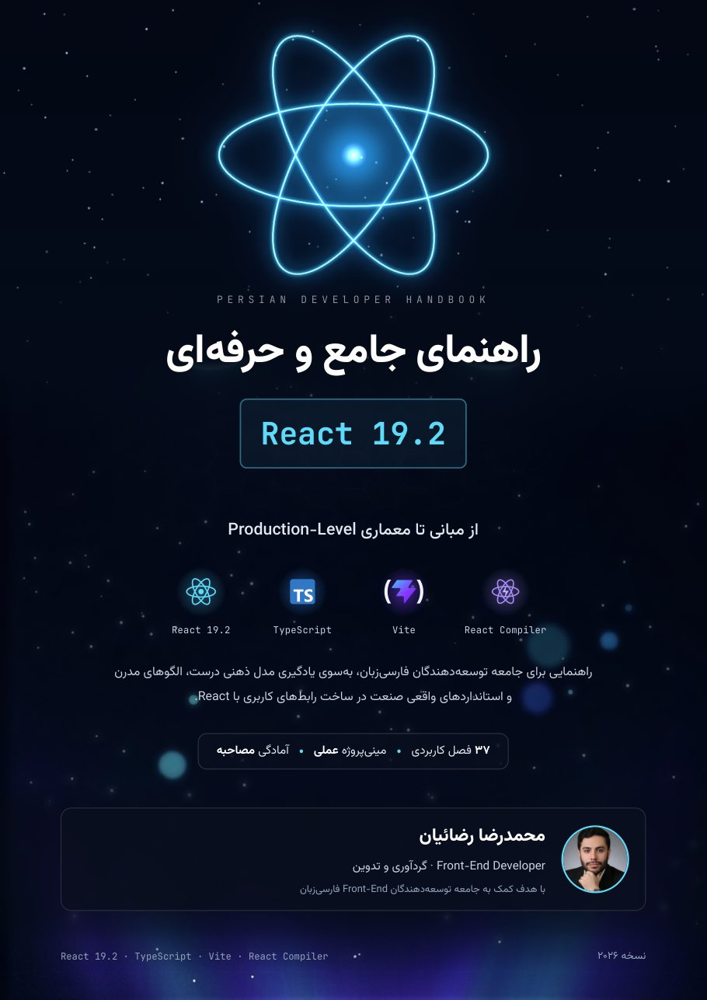
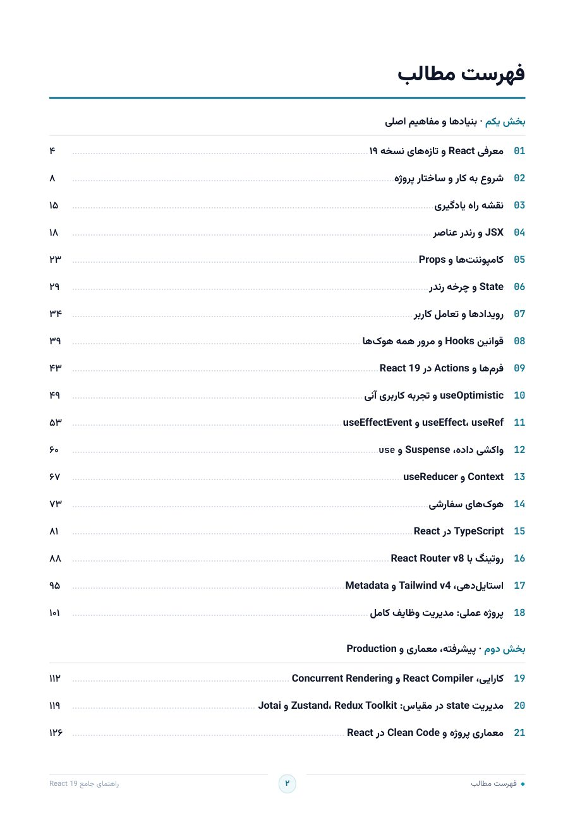
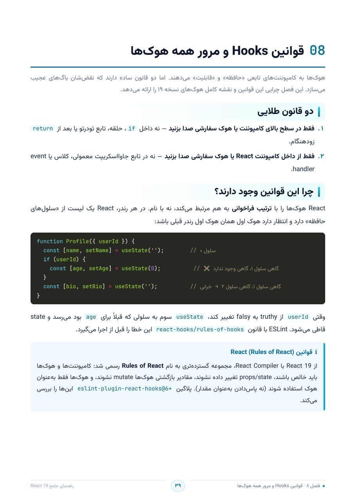
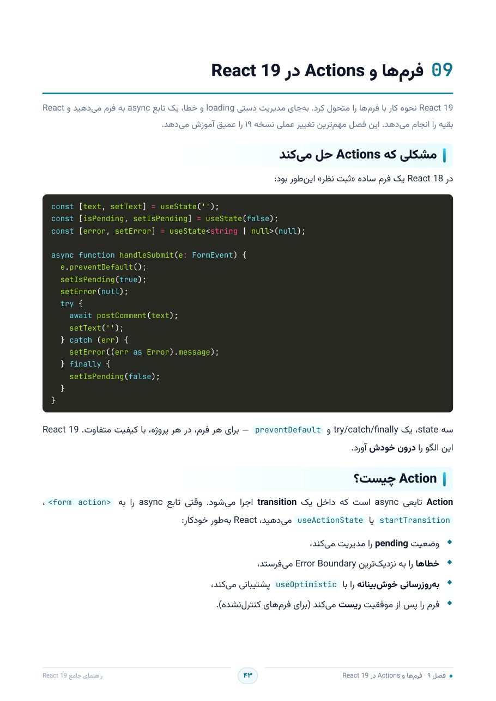
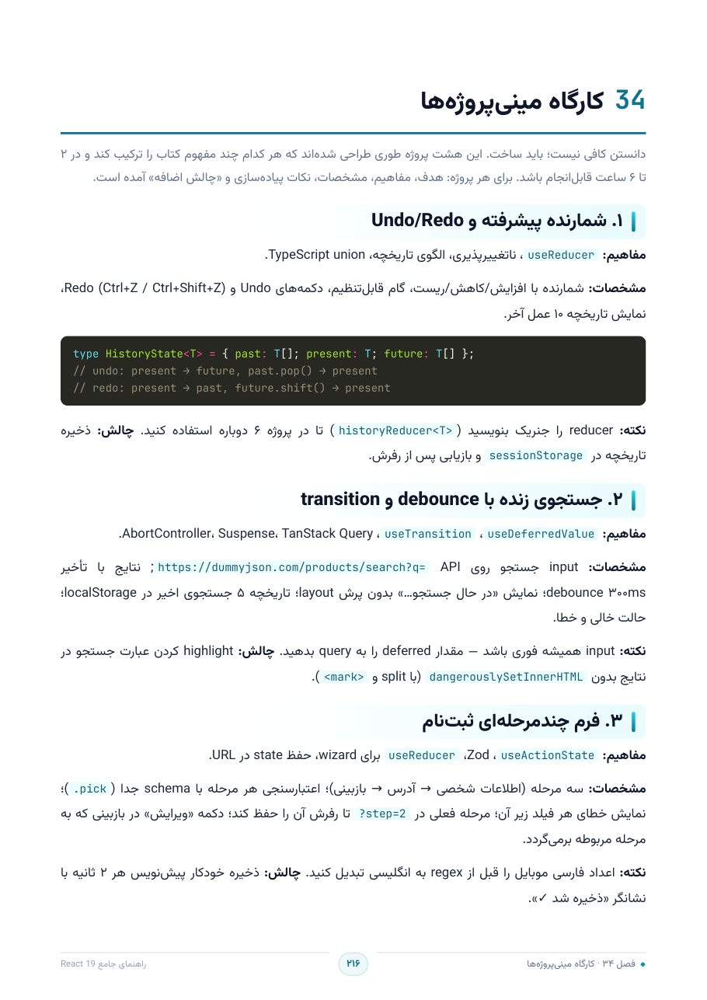
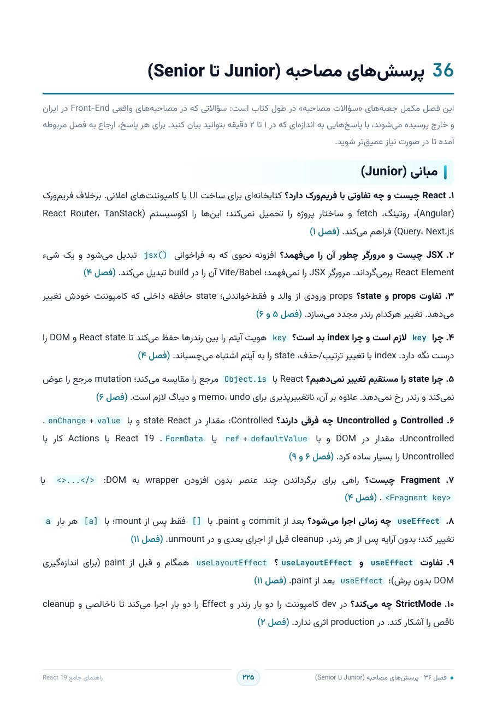

<a id="top"></a>

<div align="center">


</div>

<div dir="rtl" align="center">

# ⚛️ مرجع جامع React 19

**از مبانی تا معماری Production-Level** — کامل‌ترین مرجع فارسی React ۱۹.۲، پروژه‌محور و بر پایهٔ مدل ذهنی درست.

<sub>ویرایش ۱.۰.۳ · ۲۰۲۶</sub>

</div>

<div dir="ltr" align="center">


<br>

[](./docs/pdf/React19-Persian-Guide.pdf)
[](./docs/pdf/React19-Persian-Guide.epub)
[](./docs/pdf/React19-Persian-Guide-Print.pdf)
[](https://rezaian-dev.github.io/react-19-persian-guide/)

</div>

---

<table dir="rtl" align="center">
<tr>
<td valign="top" width="50%">

1. [📖 چرا این مرجع؟](#mokhaddame)
2. [📌 کتاب در یک نگاه](#amar)
3. [🎯 برای چه کسی است؟](#dar-khoonand)
4. [🗺️ مسیرهای خواندن](#mosirha)
5. [👀 نگاهی به داخل](#fares)

</td>
<td valign="top" width="50%">

6. [📚 فصل‌ها](#faselha)
7. [📥 دانلود سه نسخه](#danlod)
8. [🛠️ ساخت از سورس](#sakht)
9. [❓ پرسش‌های پرتکرار](#faq)
10. [👤 نویسنده و مجوز](#moalef)

</td>
</tr>
</table>

---

<div dir="rtl">

<a id="mokhaddame"></a>

## ✨ چرا این مرجع؟

<table>
<tr>
<td align="right" valign="top" width="50%" dir="rtl">

### 🧠 مدل ذهنی، نه حفظ API

هر فصل با «چرا» شروع می‌شود: رندر چیست، state کِی عوض می‌شود، چرا یک `console.log` مقدار تازه را نشان نمی‌دهد و چرا یک Effect بی‌پایان اجرا نمی‌شود. بعد از این کتاب می‌توانید پیش‌بینی کنید React چه کار می‌کند — نه اینکه حدس بزنید.

</td>
<td align="right" valign="top" width="50%" dir="rtl">

### ⚡ به‌روز با React 19.2 و Compiler 1.0

همهٔ تغییرات نسخهٔ ۱۹.۲ پوشش داده شده: Actions و `useActionState`، `useOptimistic`، `useEffectEvent`، `<Activity>`، هوک `use`، Suspense و Server Components — هرچه پایدار است آموزش داده می‌شود و «آزمایشی»ها با همان برچسب آمده‌اند.

</td>
</tr>
<tr>
<td align="right" valign="top" width="50%" dir="rtl">

### 🔬 ۲۰ اشتباه رایج، کالبدشکافی‌شده

در ۱۶ جعبهٔ «اشتباه رایج» و ۲۰ مورد فصل ۳۵: کد غلط، دلیلِ درست فکر کردن، و نسخهٔ صحیح کنار هم. دقیقاً همان چیزهایی که در Code Review گرفته می‌شوند.

</td>
<td align="right" valign="top" width="50%" dir="rtl">

### 🚀 پلی تا Production

معماری feature-based، تست با Vitest و Playwright، امنیت و CSP، دسترسی‌پذیری و RTL، Web Vitals و استقرار؛ در انتها ۴۵ پرسش مصاحبه از Junior تا Senior با پاسخ‌های ۱ تا ۲ دقیقه‌ای.

</td>
</tr>
</table>

</div>

<div dir="rtl">

حفظ‌کردن API راه یادگیری React نیست. این کتاب، در ۳۷ فصل، دقیقاً برای همان «چرا» نوشته شده است: از JSX تا Server Components، با کد واقعی TypeScript در ۳۰ فصل و یک جعبهٔ «اشتباه رایج» که توضیح می‌دهد چرا آن کارِ آشنا، غلط است.

</div>

---

<div dir="rtl">

<a id="amar"></a>

## 📌 کتاب در یک نگاه

<table align="center" dir="rtl">
<tr><td align="center" width="25%"><b>۳۷</b><br><sub>فصل در ۴ بخش</sub></td><td align="center" width="25%"><b>۲۳۹</b><br><sub>صفحهٔ A4 (نسخهٔ رنگی)</sub></td><td align="center" width="25%"><b>۸</b><br><sub>مینی‌پروژه در کارگاه</sub></td><td align="center" width="25%"><b>۴۵</b><br><sub>پرسش مصاحبه</sub></td></tr>
<tr><td align="center" width="25%"><b>۲۵</b><br><sub>نکتهٔ طلایی</sub></td><td align="center" width="25%"><b>۲۰</b><br><sub>اشتباه رایج با راه‌حل</sub></td><td align="center" width="25%"><b>۱۳۳</b><br><sub>مدخل واژه‌نامه</sub></td><td align="center" width="25%"><b>۳</b><br><sub>نسخه: PDF · EPUB · چاپی</sub></td></tr>
</table>

</div>

---

<div dir="rtl">

<a id="dar-khoonand"></a>

## 🎯 برای چه کسی است؟

| ✅ مناسب شماست اگر… | ⚠️ فعلاً نروید سراغش اگر… |
|:--|:--|
| با JavaScript و TypeScript آشنایید و می‌خواهید React را در نسخهٔ ۱۹، درست و از پایه یاد بگیرید | تازه با `let`، `map` و Promise آشنا شده‌اید؛ از فصل‌های ۱ تا ۴ شروع کنید |
| کد می‌نویسید ولی «چرا این‌جا رندر شد؟» برایتان جعبهٔ سیاه است | فقط یک تکه‌کد آماده برای یک فرم می‌خواهید؛ این کتاب تفکر می‌دهد، نه اسنیپت |
| می‌خواهید فرم، داده و خطا را با Actions و Suspense طراحی کنید، نه `useEffect` + `loading` دستی | با کلاس‌ها و Lifecycle کار کرده‌اید و JSX ندیده‌اید؛ اول فصل ۲ را بخوانید |
| برای مصاحبه آماده می‌شوید یا می‌خواهید Code Review تیم را جدی‌تر کنید | روی نسخهٔ ۱۸ هستید و عجله دارید: اول فصل ۳۱ (مهاجرت) را بخوانید |

</div>

---

<div dir="rtl">

<a id="mosirha"></a>

## 🗺️ مسیرهای خواندن

| مسیر | فصل‌ها | چه چیزی می‌گیرید |
|:--|:--|:--|
| **مبتدی تا اولین اپلیکیشن** | از ۱ تا ۱۸ | مدل ذهنی، هوک‌ها، فرم، داده، TypeScript و یک پروژهٔ کامل مدیریت وظایف |
| **سطح Production** | از ۱۹ تا ۳۲ | کارایی، Compiler، معماری، تست، امنیت، دسترسی‌پذیری، RSC و استقرار |
| **کارگاه و تثبیت** | از ۳۳ تا ۳۵ | ۸ مینی‌پروژه، ۲۵ نکتهٔ طلایی و ۲۰ اشتباه رایج |
| **هفتهٔ مصاحبه** | فصل ۳۶ و ۳۷ | ۴۵ پرسش با پاسخ + واژه‌نامهٔ ۱۳۳ مدخلی برای مرور سریع |

سه عادت که کتاب را نتیجه‌بخش می‌کند: **یک فصل، یک بازسازی** — کد فصل را در پروژهٔ خودتان بنویسید، نه کپی؛ **جعبهٔ «اشتباه رایج» را جدی بگیرید** — دقیقاً همان چیزی که در Code Review می‌گیرند؛ و **نقشهٔ راه فصل ۳** را اول بخوانید تا مسیر پراکنده نشود.

</div>

---

<div dir="rtl">

<a id="fares"></a>

## 👀 نگاهی به داخل کتاب

با کلیک روی هر تصویر، PDF باز می‌شود.

</div>

<table align="center">
<tr>
<td align="center" width="33%">

<a href="./docs/pdf/React19-Persian-Guide.pdf" target="_blank"></a>

<sub>جلد کتاب</sub>

</td>
<td align="center" width="33%">

<a href="./docs/pdf/React19-Persian-Guide.pdf" target="_blank"></a>

<sub>فهرست مطالب با لینک داخلی</sub>

</td>
<td align="center" width="33%">

<a href="./docs/pdf/React19-Persian-Guide.pdf" target="_blank"></a>

<sub>سرآغاز فصل</sub>

</td>
</tr>
<tr>
<td align="center" width="33%">

<a href="./docs/pdf/React19-Persian-Guide.pdf" target="_blank"></a>

<sub>پنجرهٔ کد با هایلایت</sub>

</td>
<td align="center" width="33%">

<a href="./docs/pdf/React19-Persian-Guide.pdf" target="_blank"></a>

<sub>کارگاه مینی‌پروژه‌ها</sub>

</td>
<td align="center" width="33%">

<a href="./docs/pdf/React19-Persian-Guide.pdf" target="_blank"></a>

<sub>جعبهٔ سؤالات مصاحبه</sub>

</td>
</tr>
</table>

---

<div dir="rtl">

<a id="faselha"></a>

## 📚 فصل‌ها

چک‌لیست کامل ۳۷ فصل؛ بخش‌های بسته با یک کلیک باز می‌شوند.

</div>

<details open>
<summary><b>بخش یکم — بنیادها و مفاهیم اصلی</b> &nbsp;·&nbsp; ۱۸ فصل</summary>

<div dir="rtl">

ستون‌های مدل ذهنی: از JSX تا Actions، Suspense، TypeScript و روتینگ.

| # | فصل | محور فصل |
|:--:|:--|:--|
| ۱ | **معرفی React و تازه‌های نسخه ۱۹** | کتابخانه چیست، چه مشکلی را حل می‌کند و در نسخه ۱۹ چه تغییر کرده |
| ۲ | **شروع به کار و ساختار پروژه** | نصب با Vite، ساختار فولدرها، ابزارهای توسعه و اولین کامپوننت |
| ۳ | **نقشه راه یادگیری** | مسیر مبتدی تا حرفه‌ای و نحوه استفاده از این کتاب |
| ۴ | **JSX و رندر عناصر** | قواعد JSX، عبارات، شرط‌ها، لیست‌ها و Fragment |
| ۵ | **کامپوننت‌ها و Props** | ترکیب، children، ref به‌عنوان prop و الگوهای طراحی API کامپوننت |
| ۶ | **State و چرخه رندر** | useState، به‌روزرسانی‌های دسته‌ای، ناتغییرپذیری و مدل ذهنی رندر |
| ۷ | **رویدادها و تعامل کاربر** | SyntheticEvent، الگوهای handler، propagation و دسترسی‌پذیری |
| ۸ | **قوانین Hooks و مرور همه هوک‌ها** | چرا قوانین وجود دارند، جدول مرجع کامل هوک‌های React 19 و انتخاب هوک درست |
| ۹ | **فرم‌ها و Actions در React 19** | `<form action>`، useActionState، useFormStatus و Progressive Enhancement |
| ۱۰ | **useOptimistic و تجربه کاربری آنی** | به‌روزرسانی خوش‌بینانه، بازگشت خودکار و الگوهای لایک، حذف و مرتب‌سازی |
| ۱۱ | **useEffect، useRef و useEffectEvent** | همگام‌سازی با سیستم‌های خارجی، cleanup، وابستگی‌ها و جدایی رویداد از Effect |
| ۱۲ | **واکشی داده، Suspense و `use`** | مدل ذهنی Suspense، API جدید `use`، Error Boundary و TanStack Query |
| ۱۳ | **Context و useReducer** | اشتراک داده بدون prop drilling، الگوی Provider، reducer و ترکیب این دو |
| ۱۴ | **هوک‌های سفارشی** | استخراج منطق قابل‌استفاده‌مجدد، قراردادها و کتابخانه هوک‌های پرکاربرد |
| ۱۵ | **TypeScript در React** | تایپ‌دهی props، رویدادها، هوک‌ها، جنریک‌ها و الگوهای React 19 |
| ۱۶ | **روتینگ با React Router v8** | مسیرهای تودرتو، loader و action، navigation و مسیرهای محافظت‌شده |
| ۱۷ | **استایل‌دهی، Tailwind v4 و Metadata** | CSS Modules، Tailwind، shadcn/ui، RTL و تگ‌های `<title>`/`<meta>` داخلی React 19 |
| ۱۸ | **پروژه عملی: مدیریت وظایف کامل** | ترکیب مفاهیم بخش یکم در یک اپلیکیشن واقعی با Actions، Optimistic UI، Context و روتینگ |

</div>
</details>

<details>
<summary><b>بخش دوم — پیشرفته، معماری و Production</b> &nbsp;·&nbsp; ۱۴ فصل</summary>

<div dir="rtl">

کارایی و React Compiler، state در مقیاس، تست، امنیت، دسترسی‌پذیری، RSC و استقرار.

| # | فصل | محور فصل |
|:--:|:--|:--|
| ۱۹ | **کارایی، React Compiler و Concurrent Rendering** | memo/useMemo/useCallback، Compiler، useTransition، useDeferredValue و پروفایلینگ |
| ۲۰ | **مدیریت state در مقیاس: Zustand، Redux Toolkit و Jotai** | انواع state، معیار انتخاب ابزار، الگوهای store و ترکیب با داده سرور |
| ۲۱ | **معماری پروژه و Clean Code در React** | ساختار feature-based، لایه‌بندی، مرزهای ماژول و اصول کد تمیز |
| ۲۲ | **الگوهای پیشرفته کامپوننت** | Compound Components، Portal، Controlled/Uncontrolled، Polymorphic و Headless UI |
| ۲۳ | **فرم‌ها و اعتبارسنجی پیشرفته** | Zod، schema مشترک، خطاهای فیلدی، React Hook Form و فرم‌های چندمرحله‌ای |
| ۲۴ | **مدیریت خطا — مرجع کامل** | Error Boundary، خطاهای async، گزینه‌های createRoot در React 19 و استراتژی چندلایه |
| ۲۵ | **دسترسی‌پذیری، RTL و بین‌المللی‌سازی** | ARIA، مدیریت فوکوس، کیبورد، Intl API و پشتیبانی فارسی |
| ۲۶ | **امنیت اپلیکیشن React** | XSS، احراز هویت و توکن‌ها، CSRF، CSP، وابستگی‌ها و آسیب‌پذیری‌های RSC |
| ۲۷ | **تست‌نویسی: Vitest، Testing Library و Playwright** | هرم تست، تست کامپوننت با رفتار کاربر، mock کردن شبکه با MSW و تست E2E |
| ۲۸ | **Server Components و Server Functions** | مدل ذهنی «دو کامپیوتر»، مرز `'use client'`، `'use server'`، `cache` و Streaming |
| ۲۹ | **انتخاب فریم‌ورک: Next.js، React Router و TanStack Start** | SPA یا فریم‌ورک؟ مقایسه عملی، معیارهای انتخاب و مسیر مهاجرت از Vite |
| ۳۰ | **Build، استقرار و Web Vitals** | بهینه‌سازی باندل، Docker و Nginx، CI/CD، Core Web Vitals و پایش |
| ۳۱ | **مهاجرت و ارتقا به React 19** | تغییرات شکننده، codemodها، به‌روزرسانی تایپ‌ها و پذیرش تدریجی React Compiler |
| ۳۲ | **انیمیشن، View Transitions و حس «نرم بودن»** | CSS-first، Motion، View Transitions API و کامپوننت آزمایشی `<ViewTransition>` |

</div>
</details>

<details>
<summary><b>بخش سوم — کارگاه عملی و نکات طلایی</b> &nbsp;·&nbsp; ۳ فصل</summary>

<div dir="rtl">

۸ مینی‌پروژهٔ صفر تا صد، ۲۵ نکتهٔ طلایی و ۲۰ اشتباه رایج با راه‌حل.

| # | فصل | محور فصل |
|:--:|:--|:--|
| ۳۳ | **نکات و ترفندهای طلایی** | ۲۵ نکته‌ای که سال‌ها تجربه را در چند صفحه خلاصه می‌کند |
| ۳۴ | **کارگاه مینی‌پروژه‌ها** | هشت پروژه کوچک صفر تا صد برای تثبیت مفاهیم، به‌ترتیب سختی |
| ۳۵ | **بهترین شیوه‌ها، اشتباهات رایج و منابع** | جمع‌بندی حرفه‌ای، ۲۰ اشتباه پرتکرار با راه‌حل، و مسیر ادامه یادگیری |

</div>
</details>

<details>
<summary><b>بخش چهارم — مرجع سریع و آمادگی مصاحبه</b> &nbsp;·&nbsp; ۲ فصل</summary>

<div dir="rtl">

پرسش‌های مصاحبه در سه سطح و واژه‌نامهٔ فارسی–انگلیسی.

| # | فصل | محور فصل |
|:--:|:--|:--|
| ۳۶ | **پرسش‌های مصاحبه (Junior تا Senior)** | ۴۵ سؤال پرتکرار با پاسخ دقیق، دسته‌بندی‌شده بر اساس موضوع و سطح |
| ۳۷ | **واژه‌نامه فارسی–انگلیسی** | مرجع سریع اصطلاحات کلیدی React 19 و اکوسیستم آن |

</div>
</details>

---

<div dir="rtl">

<a id="danlod"></a>

## 📥 دانلود سه نسخهٔ کتاب

| نسخه | فایل | مناسب برای |
|:--|:--|:--|
| 🖥️ **رنگی (اصلی)** | [React19-Persian-Guide.pdf](./docs/pdf/React19-Persian-Guide.pdf) — ۲۳۹ صفحه | مطالعه روی مانیتور و تبلت؛ بوک‌مارک فصل‌ها، متن قابل‌جستجو و شمارهٔ صفحهٔ فارسی |
| 📱 **موبایل و کتاب‌خوان** | [React19-Persian-Guide.epub](./docs/pdf/React19-Persian-Guide.epub) — ۶۱۵ کیلوبایت | EPUB 3 قابل‌بازچینش با RTL و قلم‌های جاسازی‌شده؛ Apple Books، Google Play Books، KOReader، Calibre |
| 🖨️ **چاپ سیاه‌وسفید** | [React19-Persian-Guide-Print.pdf](./docs/pdf/React19-Persian-Guide-Print.pdf) — ۲۴۰ صفحه | پرینتر لیزری؛ پس‌زمینهٔ روشن و مصرف جوهر حداقلی |

هر سه فایل روی [Release نسخهٔ ۱.۰.۳](https://github.com/rezaian-dev/react-19-persian-guide/releases/tag/v1.0.3) هم ضمیمه‌اند و [صفحهٔ معرفی](https://rezaian-dev.github.io/react-19-persian-guide/) پیش‌نمایش صفحات را همراه دانلود مستقیم نشان می‌دهد.

</div>

---

<div dir="rtl">

<a id="sakht"></a>

## 🛠️ ساخت از سورس

متن کتاب Markdown است و هر سه نسخهٔ خروجی از همان منبع ساخته می‌شود:

</div>

```bash
git clone https://github.com/rezaian-dev/react-19-persian-guide.git
cd react-19-persian-guide/src
pip install -r requirements.txt     # WeasyPrint + markdown-it + Pygments + PyMuPDF
python3 build.py                    # → React19-Persian-Guide.pdf
python3 build.py --print            # → B/W print edition
python3 build.py --html             # → build/book.html for a quick browser preview
python3 build_epub.py               # → React19-Persian-Guide.epub
```

<div dir="rtl">

ساختار مخزن عمداً کوچک نگه داشته شده: ۵ فایل در ریشه، دو پوشه، بدون CI و بدون نسخهٔ تکراری از یک فایل — «هر فایل، یک خانه».

</div>

```text
├── src/            ← the book: 37 chapters, styles, fonts, two builders, artwork
│   ├── chapters/       ← Markdown + front-matter (num, part, title, subtitle, lead)
│   ├── style.css       ← colour A4/RTL        style-print.css  ← B/W print overlay
│   ├── build.py        ← Markdown → PDF       build_epub.py    ← Markdown → EPUB 3
│   └── fonts/ banner/  ← Vazirmatn · JetBrains Mono · Noto Emoji · repo artwork
└── docs/           ← GitHub Pages (main → /docs) and the 3 downloadable files
```

---

<div dir="rtl">

<a id="faq"></a>

## ❓ پرسش‌های پرتکرار

<details>
<summary><b>آیا کتاب رایگان است؟</b></summary>

<div dir="rtl">

بله. هر سه نسخه در همین مخزن و روی [Release](https://github.com/rezaian-dev/react-19-persian-guide/releases/tag/v1.0.3) با مجوز **CC BY-NC-SA ۴.۰** منتشر شده‌اند: استفاده و اشتراک‌گذاری آزاد با ذکر منبع، غیرتجاری.

</div>
</details>

<details>
<summary><b>برای کدام نسخهٔ React نوشته شده؟</b></summary>

<div dir="rtl">

بر پایهٔ React ۱۹.۲ و React Compiler ۱.۰ نوشته شده؛ بخش «مهاجرت» (فصل ۳۱) مسیر ارتقای ۱۸ به ۱۹ و codemodها را پوشش می‌دهد.

</div>
</details>

<details>
<summary><b>بدون پیش‌زمینهٔ React می‌توانم شروع کنم؟</b></summary>

<div dir="rtl">

فصل‌های ۱ تا ۴ از صفر شروع می‌کنند. اگر با JavaScript تازه کار کرده‌اید، اول فصل ۳ (نقشهٔ راه) را بخوانید تا مسیر پراکنده نشود.

</div>
</details>

<details>
<summary><b>برای چاپ مناسب است؟</b></summary>

<div dir="rtl">

بله؛ نسخهٔ چاپی سیاه‌وسفید (۲۴۰ صفحه) با پس‌زمینهٔ روشن و مصرف جوهر حداقلی طراحی شده و همان صفحه‌بندی را دارد.

</div>
</details>

<details>
<summary><b>کتاب روی موبایل چطور خوانده می‌شود؟</b></summary>

<div dir="rtl">

نسخهٔ EPUB 3 قابل‌بازچینش است، راست‌به‌چپ می‌ماند و قلم‌های وزیرمتن و JetBrains Mono هم داخلش جاسازی شده‌اند؛ برای Apple Books، Google Play Books، KOReader و Calibre آماده شده است.

</div>
</details>

<details>
<summary><b>چطور خطا را گزارش بدهم یا فصلی را اصلاح کنم؟</b></summary>

<div dir="rtl">

یک Issue بزنید یا مستقیم PR بفرستید — فایل فصل‌ها در `src/chapters/` است و هر سه خروجی با چند دستور محلی ساخته می‌شوند ([CONTRIBUTING.md](./CONTRIBUTING.md)).

</div>
</details>

</div>

---

<div dir="rtl">

<a id="moalef"></a>

## 👤 نویسندهٔ کتاب و مجوز

<table dir="rtl">
<tr>
<td align="center" valign="top" width="90"><br><sub><b>محمدرضا رضائیان</b></sub></td>
<td dir="rtl">

نویسندهٔ [مرجع جامع Next.js 16](https://github.com/rezaian-dev/nextjs-16-persian-guide) و Front-End Developer؛ این کتاب دومِ همان مسیر است: بعد از فریم‌ورک، پایهٔ خودِ React.

<p dir="rtl">اثر تحت مجوز <b>CC BY-NC-SA 4.0</b>: استفاده و اشتراک‌گذاری آزاد با ذکر منبع، غیرتجاری و با حفظ همان مجوز. کدهای نمونهٔ کتاب آزادند و این محدودیت فقط متنی است.</p>

</td>
</tr>
</table>

```bibtex
@book{react19-persian-guide,
  title   = {مرجع جامع React 19 — از مبانی تا معماری Production-Level},
  author  = {Rezaian, Mohammadreza},
  year    = {2026},
  edition = {1.0.3},
  url     = {https://github.com/rezaian-dev/react-19-persian-guide}
}
```

</div>

---

<div dir="rtl" align="center">

**⭐ اگر کتاب مفید بود، یک Star بزرگ‌ترین کمک است.**

اشتراک‌گذاری، گزارش خطا و Pull Request هم به همان اندازه ارزشمندند — برای مشارکت، [CONTRIBUTING.md](./CONTRIBUTING.md) را ببینید.

[⬆ بازگشت به بالا](#top)

</div>
