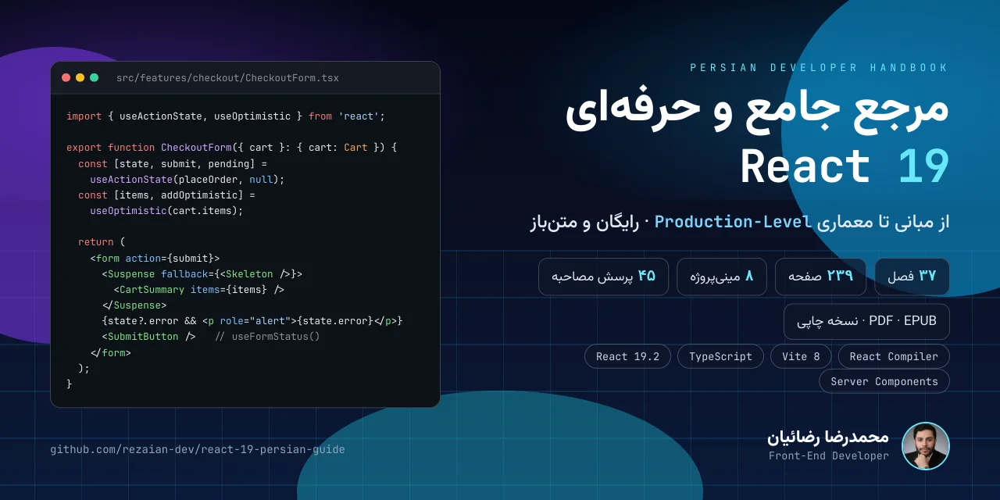
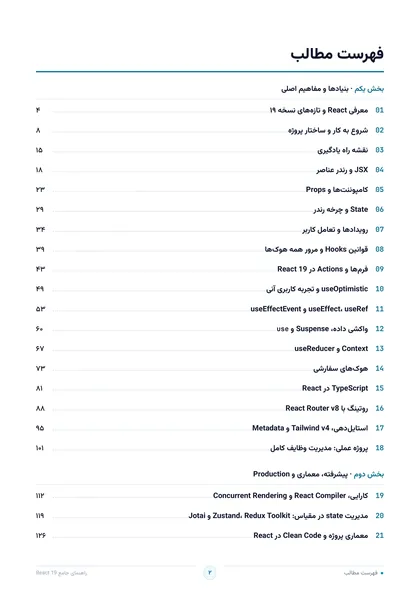
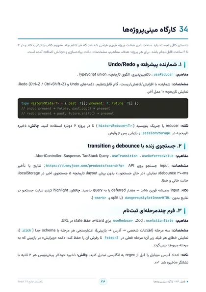

<a id="top"></a>

<p align="center">
  
</p>

<p align="center" dir="rtl">
  <strong>از اولین کامپوننت تا معماری رابط کاربری در Production</strong>
  <br>
  راهنمای فارسی و پروژه‌محور React 19.2؛ با تمرکز بر مدل رندر، Actions، Suspense، React Compiler، تست و معماری مقیاس‌پذیر.
</p>

<p align="center">
  <a href="https://rezaian-dev.github.io/react-19-persian-guide/"></a>
  <a href="./docs/pdf/React19-Persian-Guide.pdf"></a>
  <a href="./docs/pdf/React19-Persian-Guide.epub"></a>
</p>

<p align="center">
  
  
  
  
  
</p>

<p align="center" dir="rtl">
  <a href="#about">درباره</a> ·
  <a href="#path">مسیر یادگیری</a> ·
  <a href="#chapters">فهرست فصل‌ها</a> ·
  <a href="#preview">پیش‌نمایش</a> ·
  <a href="#editions">نسخه‌ها</a> ·
  <a href="#build">ساخت از سورس</a> ·
  <a href="#collection">مجموعه</a>
</p>

---

<div dir="rtl">

<a id="about"></a>

## درباره راهنما

مرجع فارسی React 19.2 در ۳۷ فصل؛ از JSX، State و Hooks تا Actions، Suspense، React Compiler، تست، امنیت و معماری. دانلود رایگان PDF و EPUB.

این راهنما بر **مدل ذهنی، تحلیل رفتار و تصمیم‌گیری فنی** تمرکز دارد. هدف این نیست که مجموعه‌ای از APIها حفظ شود؛ هدف این است که بتوانید مسئله را بفهمید، راه‌حل را ارزیابی کنید و کدی بنویسید که در پروژهٔ واقعی قابل نگهداری باشد.

### ویژگی‌ها

- **مدل رندر را بفهمید:** State، batching، reconciliation و چرخهٔ رندر با تمرکز بر دلیل رفتار کامپوننت‌ها آموزش داده می‌شوند.
- **همگام با React 19.2:** Actions، useActionState، useOptimistic، use، useEffectEvent، Activity و React Compiler در یک مسیر منسجم.
- **تمرین و پروژهٔ واقعی:** یک پروژهٔ کامل مدیریت وظایف و ۸ مینی‌پروژه برای تثبیت الگوها، هوک‌ها و تصمیم‌های طراحی.
- **معماری در مقیاس:** ساختار feature-based، مدیریت state، الگوهای کامپوننت و مرزبندی مسئولیت‌ها در کدبیس بزرگ.
- **کیفیت در Production:** تست با Vitest و Playwright، امنیت، دسترسی‌پذیری، RTL، Web Vitals و استقرار.
- **مهاجرت و آمادگی مصاحبه:** مسیر ارتقا به React 19، خطاهای رایج، پرسش‌های سطح‌بندی‌شده و واژه‌نامهٔ تخصصی.

<a id="path"></a>

## مسیر یادگیری

### ۱. بنیادها و مفاهیم اصلی

**فصل‌های ۱ تا ۱۸** — JSX، Props، State، Hooks، Actions، Suspense، Context، TypeScript، Routing و پروژهٔ مدیریت وظایف.

دستاورد: **ساخت مدل ذهنی و درک رفتار پایه**

### ۲. معماری و Production

**فصل‌های ۱۹ تا ۳۲** — Compiler، Performance، مدیریت state، معماری، امنیت، تست، Server Components، استقرار و مهاجرت.

دستاورد: **تسلط بر الگوها و قابلیت‌های مدرن**

### ۳. کارگاه و تثبیت

**فصل‌های ۳۳ تا ۳۵** — ترفندهای کاربردی، کارگاه ۸ مینی‌پروژه و بررسی اشتباهات رایج با راه‌حل.

دستاورد: **طراحی کد پایدار و قابل نگهداری**

### ۴. مرجع و آمادگی شغلی

**فصل‌های ۳۶ تا ۳۷** — پرسش‌های مصاحبه از Junior تا Senior و واژه‌نامهٔ فارسی–انگلیسی برای مرور سریع.

دستاورد: **تثبیت آموخته‌ها و آمادگی پروژه**

> برای مطالعهٔ پیوسته از بخش اول شروع کنید. اگر تجربهٔ عملی دارید، می‌توانید مستقیماً به مرحلهٔ متناسب با نیاز فعلی خود بروید.

<a id="chapters"></a>

## فهرست فصل‌ها

فهرست کامل در چهار بخش جمع شده است تا صفحه خلوت بماند. برای مشاهدهٔ فصل‌ها، هر بخش را باز کنید.

<details>
<summary><strong>بخش اول — بنیادها و مفاهیم اصلی</strong> · فصل‌های ۱ تا ۱۸</summary>

1. [معرفی React و تازه‌های نسخه ۱۹](./src/chapters/01-intro.md)
2. [شروع به کار و ساختار پروژه](./src/chapters/02-setup.md)
3. [نقشه راه یادگیری](./src/chapters/03-roadmap.md)
4. [JSX و رندر عناصر](./src/chapters/04-jsx.md)
5. [کامپوننت‌ها و Props](./src/chapters/05-components-props.md)
6. [State و چرخه رندر](./src/chapters/06-state.md)
7. [رویدادها و تعامل کاربر](./src/chapters/07-events.md)
8. [قوانین Hooks و مرور همه هوک‌ها](./src/chapters/08-hooks-rules.md)
9. [فرم‌ها و Actions در React 19](./src/chapters/09-forms-actions.md)
10. [useOptimistic و تجربه کاربری آنی](./src/chapters/10-optimistic.md)
11. [useEffect، useRef و useEffectEvent](./src/chapters/11-effects-refs.md)
12. [واکشی داده، Suspense و use](./src/chapters/12-data-suspense.md)
13. [Context و useReducer](./src/chapters/13-context-reducer.md)
14. [هوک‌های سفارشی](./src/chapters/14-custom-hooks.md)
15. [TypeScript در React](./src/chapters/15-typescript.md)
16. [روتینگ با React Router v8](./src/chapters/16-routing.md)
17. [استایل‌دهی، Tailwind v4 و Metadata](./src/chapters/17-styling-metadata.md)
18. [پروژه عملی: مدیریت وظایف کامل](./src/chapters/18-mini-project.md)

</details>

<details>
<summary><strong>بخش دوم — معماری و Production</strong> · فصل‌های ۱۹ تا ۳۲</summary>

19. [کارایی، React Compiler و Concurrent Rendering](./src/chapters/19-performance.md)
20. [مدیریت state در مقیاس: Zustand، Redux Toolkit و Jotai](./src/chapters/20-state-management.md)
21. [معماری پروژه و Clean Code در React](./src/chapters/21-architecture.md)
22. [الگوهای پیشرفته کامپوننت](./src/chapters/22-patterns.md)
23. [فرم‌ها و اعتبارسنجی پیشرفته](./src/chapters/23-forms-advanced.md)
24. [مدیریت خطا — مرجع کامل](./src/chapters/24-error-handling.md)
25. [دسترسی‌پذیری، RTL و بین‌المللی‌سازی](./src/chapters/25-accessibility-i18n.md)
26. [امنیت اپلیکیشن React](./src/chapters/26-security.md)
27. [تست‌نویسی: Vitest، Testing Library و Playwright](./src/chapters/27-testing.md)
28. [Server Components و Server Functions](./src/chapters/28-server-components.md)
29. [انتخاب فریم‌ورک: Next.js، React Router و TanStack Start](./src/chapters/29-frameworks.md)
30. [Build، استقرار و Web Vitals](./src/chapters/30-deployment.md)
31. [مهاجرت و ارتقا به React 19](./src/chapters/31-migration.md)
32. [انیمیشن، View Transitions و حس «نرم بودن»](./src/chapters/32-animation.md)

</details>

<details>
<summary><strong>بخش سوم — کارگاه و تثبیت</strong> · فصل‌های ۳۳ تا ۳۵</summary>

33. [نکات و ترفندهای طلایی](./src/chapters/33-golden-tips.md)
34. [کارگاه مینی‌پروژه‌ها](./src/chapters/34-workshop.md)
35. [بهترین شیوه‌ها، اشتباهات رایج و منابع](./src/chapters/35-best-practices.md)

</details>

<details>
<summary><strong>بخش چهارم — مرجع و آمادگی شغلی</strong> · فصل‌های ۳۶ تا ۳۷</summary>

36. [پرسش‌های مصاحبه (Junior تا Senior)](./src/chapters/36-interview.md)
37. [واژه‌نامه فارسی–انگلیسی](./src/chapters/37-glossary.md)

</details>

<a id="preview"></a>

## پیش‌نمایش

<p align="center">
  <a href="./docs/assets/page-toc.jpg"></a>
  <a href="./docs/assets/page-chapter.jpg"></a>
  <a href="./docs/assets/page-code.jpg"></a>
  <a href="./docs/assets/page-workshop.jpg"></a>
</p>

<a id="editions"></a>

## نسخه‌های در دسترس

### PDF — [نسخهٔ اصلی](./docs/pdf/React19-Persian-Guide.pdf)

**۲۳۹ صفحه · A4** — نسخهٔ رنگی و قابل جست‌وجو با فهرست داخلی برای مطالعه روی دسکتاپ و تبلت.

### EPUB — [نسخهٔ کتاب‌خوان](./docs/pdf/React19-Persian-Guide.epub)

**EPUB 3 · فونت داخلی** — نسخهٔ بازچینش‌پذیر راست‌به‌چپ برای موبایل و نرم‌افزارهای مطالعه EPUB.

### PRINT — [نسخهٔ مناسب چاپ](./docs/pdf/React19-Persian-Guide-Print.pdf)

**۲۴۰ صفحه · سیاه‌وسفید** — خروجی سیاه‌وسفید با پس‌زمینهٔ روشن و مصرف جوهر کمتر برای چاپ لیزری.

<a id="build"></a>

## ساخت از سورس

پیش‌نیاز اصلی Python 3.10 یا جدیدتر است. برای تولید PDF، وابستگی‌های سیستمی [WeasyPrint](https://doc.courtbouillon.org/weasyprint/stable/first_steps.html#installation) نیز باید نصب باشند.

### راه‌اندازی

```bash
git clone https://github.com/rezaian-dev/react-19-persian-guide.git
cd react-19-persian-guide

python -m venv .venv
source .venv/bin/activate       # macOS / Linux
# .venv\Scripts\Activate.ps1   # Windows PowerShell

python -m pip install -r src/requirements.txt
python src/build.py             # PDF رنگی
python src/build.py --print     # نسخه مناسب چاپ
python src/build.py --html      # پیش‌نمایش HTML
python src/build_epub.py        # EPUB
```

### ساختار اصلی

```text
.
├── docs/                       # سایت و سه خروجی رسمی
│   ├── assets/
│   ├── index.html
│   └── pdf/
└── src/
    ├── chapters/               # متن ۳۷ فصل
    ├── fonts/                  # فونت‌های محلی
    ├── build.py                # سازنده HTML و PDF
    ├── build_epub.py           # سازنده EPUB
    └── style*.css
```

<a id="collection"></a>

## مجموعه راهنماهای فارسی

این سه مرجع یک مسیر هماهنگ می‌سازند: ابتدا زبان JavaScript، سپس معماری رابط کاربری با React و در پایان توسعهٔ کامل با Next.js.

- **[JavaScript ES2025](https://github.com/rezaian-dev/javascript-persian-guide)** — زبان و مدل ذهنی؛ پایهٔ مشترک مسیر توسعه وب · [نسخه آنلاین](https://rezaian-dev.github.io/javascript-persian-guide/)
- **[React 19.2](https://github.com/rezaian-dev/react-19-persian-guide)** — رابط کاربری، مدیریت state و معماری کامپوننت · [نسخه آنلاین](https://rezaian-dev.github.io/react-19-persian-guide/) — **راهنمای فعلی**
- **[Next.js 16](https://github.com/rezaian-dev/nextjs-16-persian-guide)** — فریم‌ورک، رندر سرور، کشینگ و استقرار · [نسخه آنلاین](https://rezaian-dev.github.io/nextjs-16-persian-guide/)

## مشارکت

برای گزارش خطا، پیشنهاد اصلاح یا بهبود محتوا از [راهنمای مشارکت](./CONTRIBUTING.md) استفاده کنید. Pull Requestها بهتر است کوچک، متمرکز و همراه با توضیح روشن دربارهٔ دلیل تغییر باشند.

- [گزارش یک مشکل](https://github.com/rezaian-dev/react-19-persian-guide/issues)
- [مشاهده مخزن](https://github.com/rezaian-dev/react-19-persian-guide)

## نویسنده و مجوز

**محمدرضا رضائیان** — [@rezaian-dev](https://github.com/rezaian-dev)

این اثر با مجوز [Creative Commons BY-NC-SA 4.0](./LICENSE) منتشر شده است. استفاده و بازنشر غیرتجاری با ذکر منبع مجاز است و نسخهٔ اقتباسی باید با همین مجوز منتشر شود.

</div>

---

<p align="center" dir="rtl">
  اگر این راهنما برایتان مفید بود، با ثبت یک ⭐ از ادامهٔ توسعهٔ مجموعه حمایت کنید.
  <br>
  <a href="#top">بازگشت به بالا</a>
</p>
